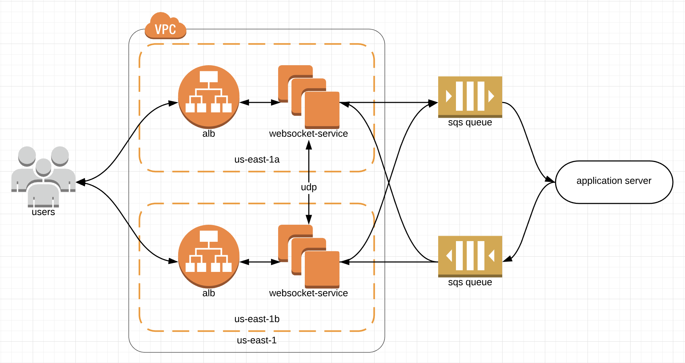

# websocket-service

This service provides WebSocket handling that allows separation of WebSocket connection handling from application servers. Whenever a WebSocket connection is made or a message is received, a message is sent to your application server. Whenever your application server wishes to respond with a message, it can send a message to the WebSocket service cluster.

## Why?

Separating WebSocket handling into a separate service has many advantages:

* The service is easy to scale, and it scales independently of your application. You don't need to worry about scaling up your application servers to be able to support the long-lived connections and file descriptors that WebSockets require.
* The service can improve your availability. The service is stateless, so it can trivially be used in multi-region or even multi-cloud deployments.
* As a side-effect of the multi-region capabilities, the service can improve your clients' performance by serving their connections from locations geographically closer to them.
* The service makes your application deployments faster and less disruptive. By decoupling WebSocket handling from your business logic, you don't need to sever or drain WebSocket connections when you deploy application updates.
* Eliminating WebSocket handling from your application may enable your application to be deployed to "serverless" environments.
* The service eliminates a common source of server-to-server traffic within your cluster as you no longer need to worry about routing traffic destined for WebSocket connections.

## Architecture

The service itself is very transport-agnostic. The only transport protocol you are required to use is the WebSocket protocol for client connections. The service can communicate with your origin or other nodes within the cluster via any means you'd like. For example, if you're deploying the service to a single AWS VPC, you may use UDP for inter-node communication and SQS for service-origin communication:

## Developing

The only external dependency is the Go dependency manager, [dep](https://github.com/golang/dep).

After installing `dep`, you can download the dependencies via `dep ensure`.

You can then use the standard Go commands (e.g. `go test ./...`).
